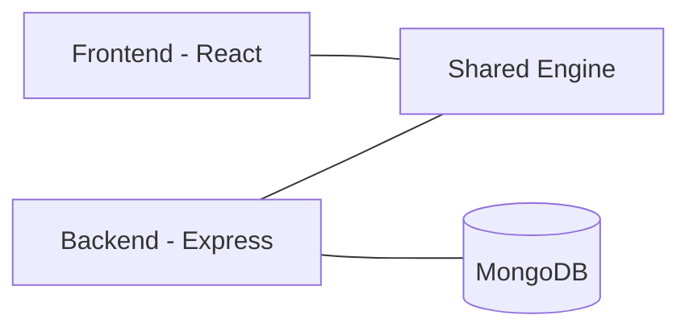

# Quantix

A comprehensive, interactive web-based visualizer for CPU scheduling algorithms, designed for students and educators. It features a modern React frontend, a robust Node.js backend for simulations, and a shared core engine.


## 🚀 Features

- **Interactive Gantt Charts**: Visualize process execution, idle times, and context switches in real-time. Keyboard-navigable and screen-reader accessible.
- **Algorithm Comparison**: Run simulations side-by-side to compare metrics like Turnaround Time and Waiting Time.
- **Step-by-Step Explanations**: Understand _why_ a scheduler made a specific decision at any given tick.
- **Multi-Core Support**: Simulate scheduling across up to 8 CPU cores with processor affinity support.
- **Energy Efficiency Metrics**: Analyze power consumption with configurable Active/Idle Watts and Context Switch energy costs.
- **Advanced Benchmarks**: Includes Standard Deviation and 95th Percentile distributions for waiting, turnaround, and response times.
- **Advanced Process Model**: Configure `tickets`, `shareGroup`, `shareWeight`, `deadline`, and `period` for proportional-share and real-time algorithms.
- **Scenario Generator Presets**: Generate datasets for Fair-Share, Lottery, EDF, RMS, starvation, and other workload styles.
- **Save & Load**: Persist your custom scenarios using MongoDB (via Google, GitHub, GitLab, Discord, LinkedIn, or Guest) or locally via IndexedDB.
- **Export**: Download results as PNG, PDF, CSV, or SVG.
- **Internationalization**: Support for 11 languages (English, Spanish, Arabic, German, Filipino, French, Hindi, Japanese, Korean, Portuguese, Chinese).
- **PWA Ready**: Installable on desktop and mobile for offline usage.
- **Storybook**: Component-driven development and visual documentation for the UI library.

## 🏗️ Architecture



The project is structured as a Monorepo:

- **`frontend/`**: React 18, Vite, Tailwind CSS, D3.js (Visualization), Storybook.
- **`backend/`**: Node.js, Express, MongoDB (API & Persistence).
- **`shared/`**: TypeScript library containing core deterministic scheduling algorithms and statistical utilities.
- **`docs/`**: Project documentation.

## 🛠️ Setup & Installation

### Prerequisites

- Node.js v20+
- npm v10+
- MongoDB (Local or Atlas) - _Optional for basic usage_

### Installation

1.  **Clone the repository:**

    ```bash
    git clone https://github.com/CodeExplorer430/quantix.git
    cd quantix
    ```

2.  **Install dependencies:**

    ```bash
    npm install
    ```

3.  **Build shared libraries:**
    ```bash
    npm run build
    ```

### Running Locally

1.  **Start the Frontend (Development):**

    ```bash
    npm run dev:frontend
    ```

    Access at `http://localhost:5173`

2.  **Start the Backend (Optional):**
    Create a `.env` file in `backend/` (see [MongoDB Setup](docs/MONGODB_SETUP.md) and [OAuth Setup Guides](docs/)) and run:

    ```bash
    npm run dev:backend
    ```

    Access at `http://localhost:3000`

3.  **Run Storybook:**
    ```bash
    npm run storybook -w frontend
    ```

## 🧠 Implemented Algorithms

Quantix currently supports **15** scheduling algorithms:

### Core Scheduling Algorithms

- **FCFS**: First-Come, First-Served
- **SJF**: Shortest Job First (non-preemptive)
- **SRTF**: Shortest Remaining Time First (preemptive)
- **RR**: Round Robin
- **PRIORITY**: Priority (non-preemptive)
- **PRIORITY_PE**: Priority (preemptive)

### Advanced & Hybrid Algorithms

- **MQ (MLQ)**: Multilevel Queue
- **MLFQ**: Multilevel Feedback Queue
- **HRRN**: Highest Response Ratio Next

### Proportional/Fair-Share Algorithms

- **FAIR_SHARE**: Group-weighted fair-share scheduling
- **LOTTERY**: Ticket-based probabilistic scheduling

### Real-Time Algorithms

- **EDF**: Earliest Deadline First
- **RMS**: Rate-Monotonic Scheduling

### Experimental/Extended

- **LJF**: Longest Job First
- **LRTF**: Longest Remaining Time First

## 📚 Documentation

- [Architecture Overview](docs/architecture.md)
- [API Documentation](docs/API.md)
- [Algorithm Implementation Guide](docs/ALGORITHM_GUIDE.md)
- [Deployment Guide](docs/DEPLOYMENT.md)
- **OAuth Setup Guides**: [Google](docs/GOOGLE_OAUTH_SETUP.md), [GitHub](docs/GITHUB_OAUTH_SETUP.md), [GitLab](docs/GITLAB_OAUTH_SETUP.md), [Discord](docs/DISCORD_OAUTH_SETUP.md), [LinkedIn](docs/LINKEDIN_OAUTH_SETUP.md)
- [MongoDB & Environment Setup](docs/MONGODB_SETUP.md)

## 🤝 Contributing

Contributions are welcome! Please check out the `FEATURES.md` for planned improvements.

1.  Fork the Project
2.  Create your Feature Branch (`git checkout -b feature/AmazingFeature`)
3.  Commit your Changes (`git commit -m 'Add some AmazingFeature'`)
4.  Push to the Branch (`git push origin feature/AmazingFeature`)
5.  Open a Pull Request

## 📄 License

This project is licensed under the MIT License - see the [LICENSE](LICENSE) file for details.
