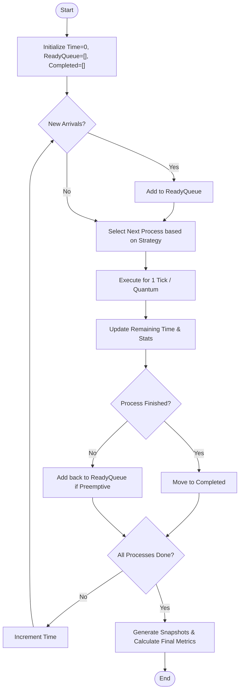

# Algorithm Implementation Guide

This guide explains how to implement new scheduling algorithms in the `shared` engine.

## Execution Flow



## Directory Structure

All algorithm logic resides in `shared/src/engine/`.

- `index.ts`: Main entry point exporting all algorithms.
- `types.ts`: Shared interfaces (`Process`, `GanttEvent`, `Metrics`).
- `utils.ts`: Helper functions (snapshot generation, sorting).
- `[algorithm].ts`: Individual algorithm implementations (e.g., `fcfs.ts`, `rr.ts`).

## Step-by-Step Implementation

To add a new algorithm (e.g., **LJF - Longest Job First**):

### 1. Define the Function Signature

Create `shared/src/engine/ljf.ts`. The function must match the standard signature:

```typescript
import { Process, SimulationResult, SimulationOptions } from '../types';
import { generateSnapshots } from './utils';

export const runLJF = (processes: Process[], options: SimulationOptions): SimulationResult => {
  // ... implementation
};
```

### 2. Implement the Logic

Most algorithms follow this pattern:

1.  Initialize time `currentTime = 0`.
2.  Maintain a `readyQueue` and `completed` list.
3.  Loop until all processes are completed.
4.  In each tick:
    - Check for new arrivals.
    - Select the next process based on the algorithm's criteria (e.g., `max(burstTime)` for LJF).
    - Execute the process (update remaining time).
    - Record events (Gantt chart logs).

### 3. Generate Snapshots & Metrics

Use the helper functions from `utils.ts` to convert your raw execution logs into the standardized format and calculate advanced benchmarks.

```typescript
import { generateSnapshots, calculateMetrics } from './utils';

// ... inside your run function
const metrics = calculateMetrics(events, inputProcesses, options);

return {
  events,
  metrics,
  snapshots: generateSnapshots(events, inputProcesses, coreCount),
};
```

`calculateMetrics` automatically computes:
- **Turnaround, Waiting, and Response times** per process.
- **Averages** across all processes.
- **Statistical Distributions**: Standard Deviation and 95th Percentile for all time metrics.
- **CPU Utilization** and **Energy Consumption** (if config provided).

### 4. Register the Algorithm

1.  Export it in `shared/src/engine/index.ts`.
2.  Add the algorithm name to the `AlgorithmType` union in `shared/src/types.ts`.
3.  Update the translation files in `frontend/src/locales/` to include the human-readable name.

## Testing

Always add tests in `shared/tests/engine/`.

1.  Create `ljf.test.ts`.
2.  Define a simple scenario (e.g., 3 processes).
3.  Manually calculate the expected start/end times (including `coreId: 0` for single-core).
4.  Assert that `runLJF` matches your expectations.

```typescript
test('LJF should prioritize longer jobs', () => {
  const result = runLJF(processes, {});
  expect(result.events[0]).toEqual({ pid: 'P1', start: 0, end: 10, coreId: 0 });
});
```
