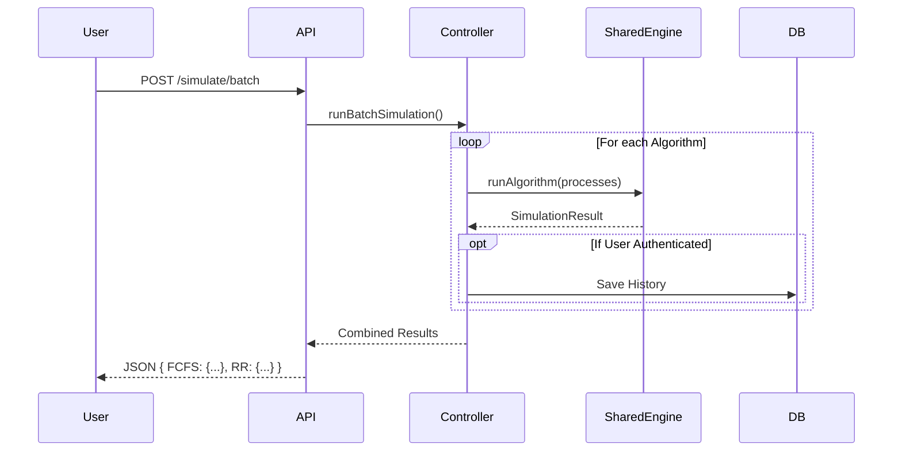

# API Documentation

The backend provides a RESTful API for managing user scenarios and offloading heavy simulations.

## Base URL

Development: `http://localhost:3000/api`
Production: `https://quantix-api.onrender.com/api`

## Authentication

All protected routes require a Bearer Token.

**Header:**
`Authorization: Bearer <jwt_token>`

### 1. Register

- **Endpoint**: `POST /auth/register`
- **Body**:
  ```json
  {
    "username": "jdoe",
    "email": "jdoe@example.com",
    "password": "securepassword"
  }
  ```

### 2. Login

- **Endpoint**: `POST /auth/login`
- **Body**:
  ```json
  {
    "email": "jdoe@example.com",
    "password": "securepassword"
  }
  ```

### 3. OAuth Authentication

- **Endpoints**:
  - `GET /auth/google`
  - `GET /auth/github`
  - `GET /auth/gitlab`
  - `GET /auth/discord`
  - `GET /auth/linkedin`
- **Description**: Redirects user to the respective provider's Sign-In page. On success, redirects back to the frontend with `?token=<jwt>`.

### 4. Magic Link

#### Request Link

- **Endpoint**: `POST /auth/magic-link`
- **Body**:
  ```json
  {
    "email": "jdoe@example.com"
  }
  ```
- **Description**: Sends a login link to the user's email (or logs to console in development).

#### Verify Link

- **Endpoint**: `POST /auth/magic-link/verify`
- **Body**:
  ```json
  {
    "token": "jwt_from_email_link"
  }
  ```
- **Description**: Verifies the magic link token and returns a session token.
- **Response**:
  ```json
  {
    "token": "jwt_token",
    "user": { ... }
  }
  ```

---

## Simulation Workflow

### Batch Simulation Sequence



## Simulation

### Run Batch Simulation

- **Endpoint**: `POST /simulate/batch`
- **Description**: Runs multiple algorithms on the same dataset for comparison.
- **Headers**:
  - `Content-Type`: `application/json`
  - `Authorization`: `Bearer <token>` (Optional, required for history tracking)
- **Body**:
  ```json
  {
    "algorithms": ["FCFS", "RR", "SJF"],
    "processes": [
      { "pid": "P1", "arrival": 0, "burst": 5, "priority": 1 },
      { "pid": "P2", "arrival": 2, "burst": 3, "priority": 2 }
    ],
    "options": {
      "timeQuantum": 2
    }
  }
  ```
- **Response**:
  ```json
  {
    "FCFS": {
      "events": [...],
      "metrics": { "avgTurnaround": 4.5, ... }
    },
    "RR": {
      "events": [...],
      "metrics": { "avgTurnaround": 5.2, ... }
    }
  }
  ```

---

## Scenarios (Persistence)

### Upload CSV

- **Endpoint**: `POST /scenarios/upload/csv`
- **Body**: `multipart/form-data` with key `file` (CSV).
- **Format**: `Process ID, Arrival Time, Burst Time, Priority`

### Save Scenario

- **Endpoint**: `POST /scenarios`
- **Auth**: Required
- **Body**:
  ```json
  {
    "name": "My Custom Test",
    "processes": [...]
  }
  ```

### List Scenarios

- **Endpoint**: `GET /scenarios`
- **Auth**: Required
- **Description**: Returns all scenarios saved by the logged-in user.
