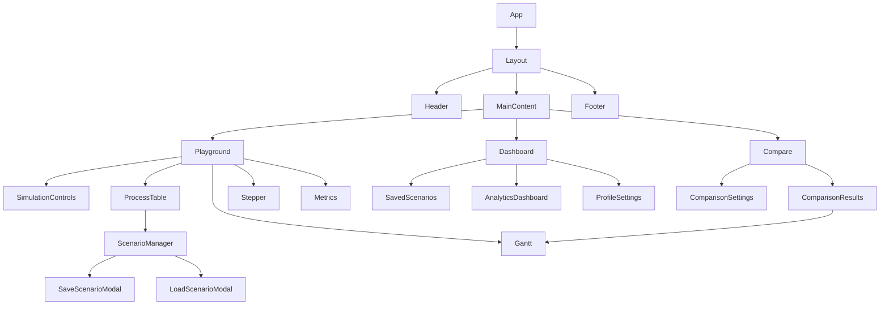
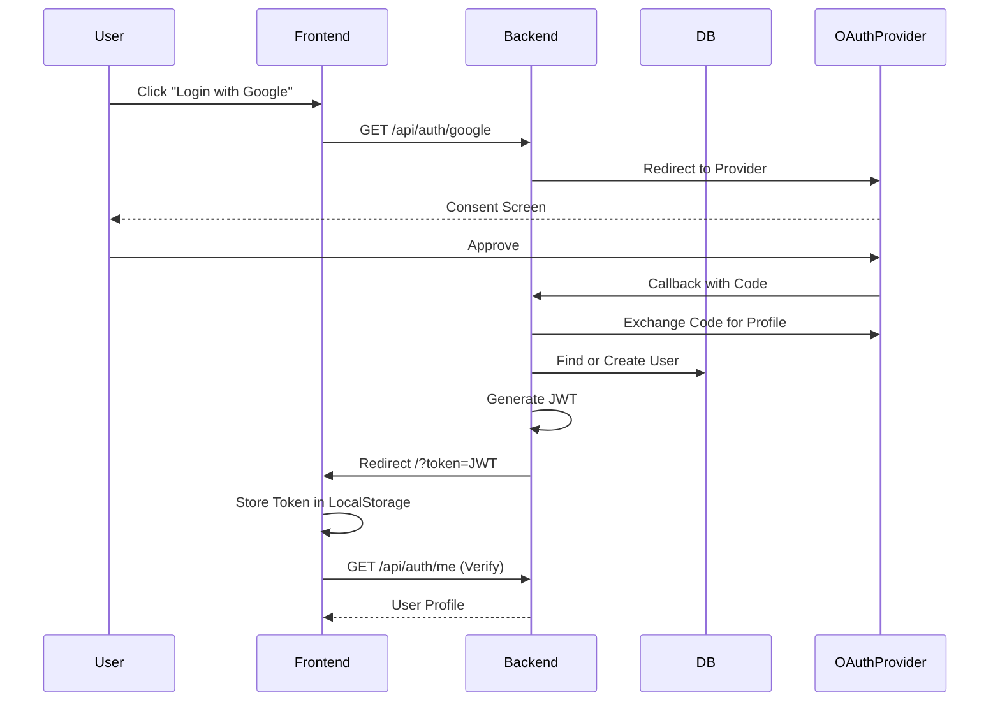
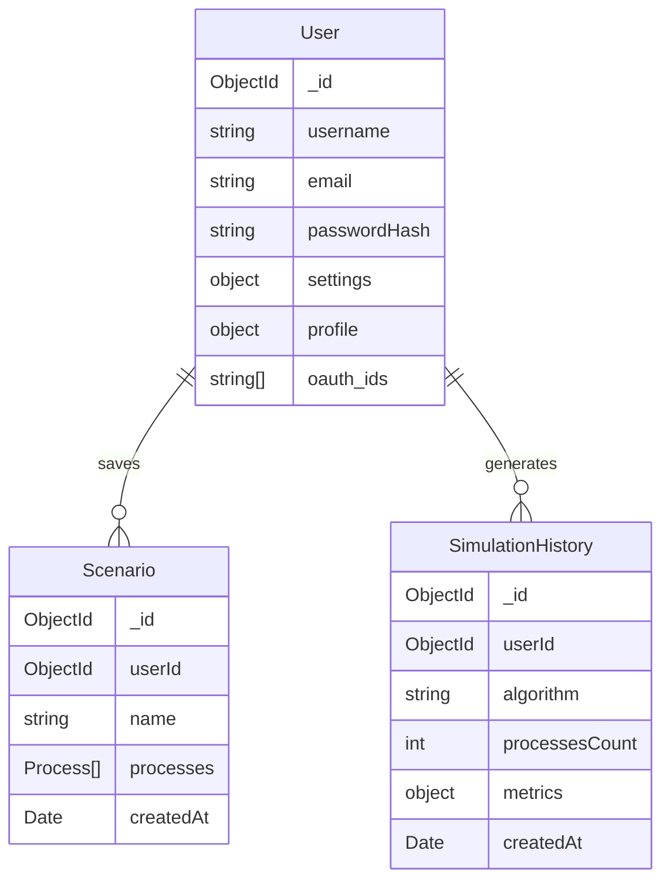
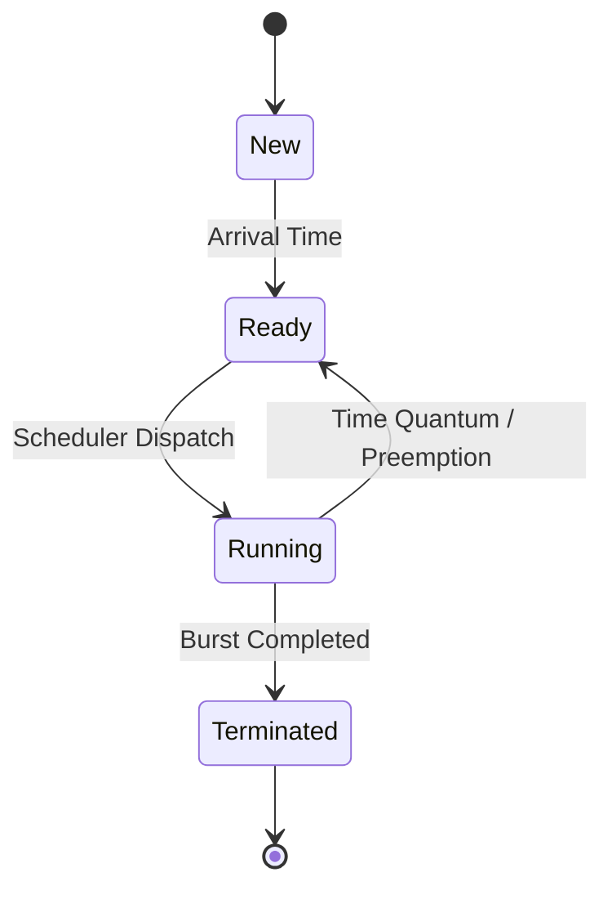
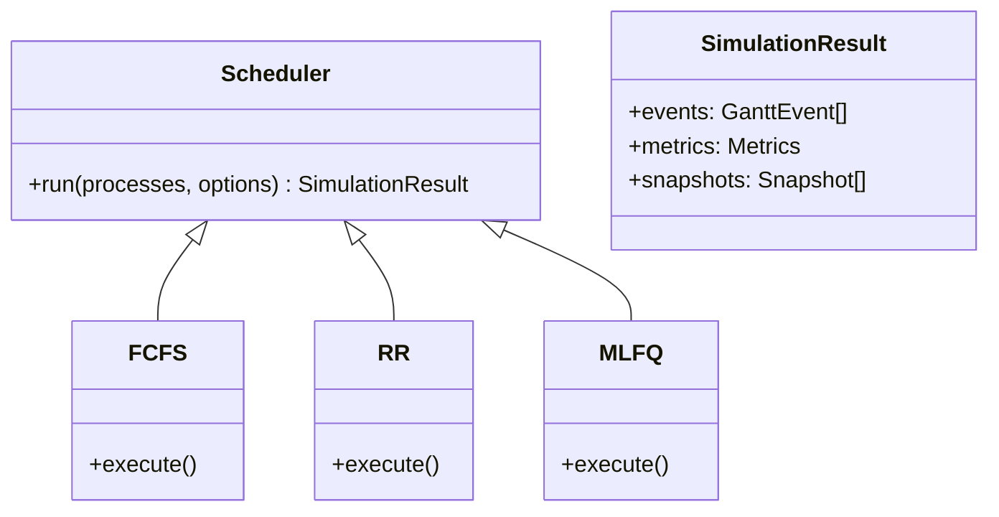

# Design Documentation

## Overview

Quantix is a CPU scheduling visualizer that runs entirely in the browser (client-side) for simulation logic, while providing optional backend services for persistence and heavy batch processing. This hybrid approach ensures low latency for interactive simulations and scalability for comprehensive analysis.

## Frontend Architecture

The frontend is built with **React** and **Vite**, using a feature-based folder structure. State is managed via React Context (`AuthContext`, `ThemeContext`) and custom hooks (`useSimulation`, `useComparison`).

### Component Hierarchy (Simplified)

### State Management

- **Global State**:
  - `AuthContext`: Manages user session (JWT), profile, and login/logout actions.
  - `ThemeContext`: Toggles Light/Dark mode and persists preference.
- **Local/Feature State**:
  - `useSimulation`: Encapsulates the core simulation engine loop, timer, and result state.
  - `useComparison`: Manages batch execution of multiple algorithms.

## Authentication Flow

Quantix supports traditional Email/Password login and OAuth (Google, GitHub, etc.).

## Data Model

## Simulation Engine

The core simulation logic resides in `@cpu-vis/shared`. It is designed to be deterministic and platform-agnostic.

### Supported Algorithm Families

- Core: `FCFS`, `SJF`, `SRTF`, `RR`, `PRIORITY`, `PRIORITY_PE`
- Advanced/Hybrid: `MQ` (MLQ), `MLFQ`, `HRRN`
- Proportional/Fair-share: `FAIR_SHARE`, `LOTTERY`
- Real-time: `EDF`, `RMS`
- Experimental/Extended: `LJF`, `LRTF`

### Process Model Extensions

Beyond classic `(pid, arrival, burst, priority)`, the shared process type supports:

- `tickets` for lottery scheduling
- `shareGroup` and `shareWeight` for fair-share scheduling
- `deadline` for EDF
- `period` for RMS

These fields are optional and algorithm-specific; defaults are applied by the corresponding engine when absent.

### Process Lifecycle

## Key Design Decisions

1.  **Client-Side Simulation**:
    - _Decision_: Run individual simulations in the browser.
    - _Reasoning_: Immediate feedback loop for the user without network latency. CPU scheduling algorithms are computationally light enough for modern browsers for typical inputs (N < 100).

2.  **Shared Library (`@cpu-vis/shared`)**:
    - _Decision_: Extract logic into a shared workspace.
    - _Reasoning_: Allows the same algorithms to be used by the Frontend (interactive) and Backend (batch processing/validation) without code duplication.

3.  **D3.js for Visualization**:
    - _Decision_: Use D3.js wrapped in React components.
    - _Reasoning_: Provides fine-grained control over the Gantt chart rendering (SVG) which is difficult to achieve with standard charting libraries like Chart.js.

4.  **Magic Link Auth**:
    - _Decision_: Implement passwordless login.
    - _Reasoning_: Reduces friction for student adoption.
