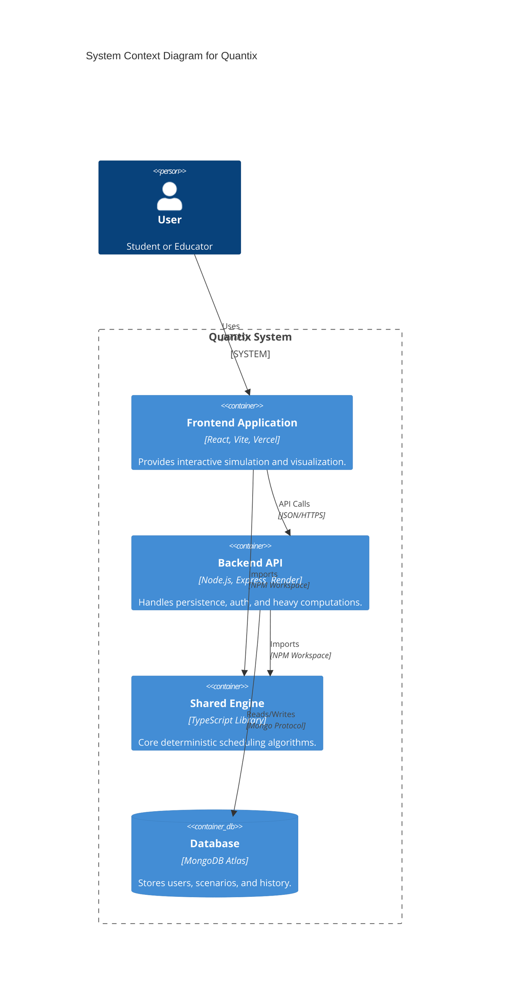
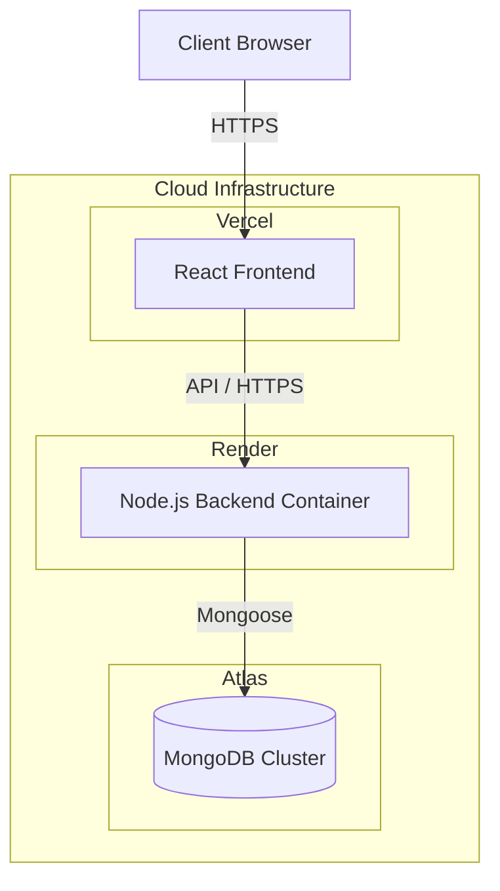
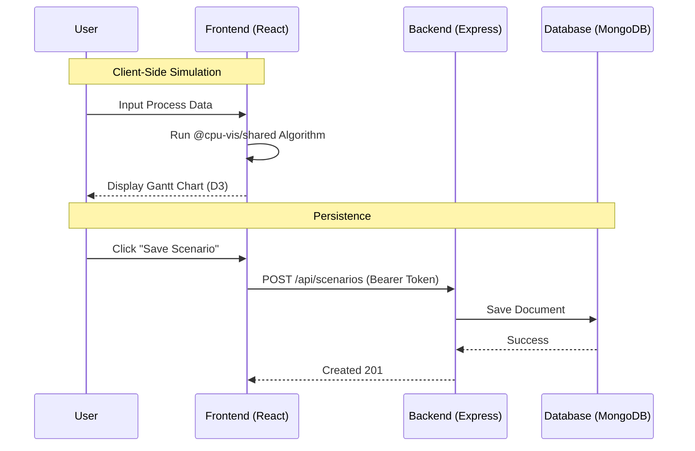

# System Architecture

## High-Level Overview (C4 Container)

## Overview

The Quantix is a full-stack monorepo designed for interactivity and performance.

- **Frontend**: React/Vite SPA (Vercel)
  - Interactive Gantt charts with D3.js
  - State management for simulations
  - Offline-first PWA support
  - Internationalization (i18n)
- **Backend**: Express/Node.js API (Render)
  - Heavy simulation offloading
  - Batch processing
  - User authentication (JWT + OAuth Providers)
  - Persistence via MongoDB
- **Shared**: TypeScript core logic (`@cpu-vis/shared`)
  - Deterministic scheduling algorithms (FCFS, RR, SJF, etc.)
  - Property-based tests
  - Shared types and validation

## Deployment Architecture

## Data Flow

## Algorithms Supported

- **FCFS**: First-Come, First-Served
- **SJF**: Shortest Job First (Non-preemptive)
- **SRTF**: Shortest Remaining Time First (Preemptive)
- **RR**: Round Robin (Time Quantum)
- **PRIORITY**: Priority Scheduling (Preemptive/Non-preemptive)
- **MLFQ**: Multilevel Feedback Queue
- **LJF/LRTF**: Longest Job/Remaining Time First
- **HRRN**: Highest Response Ratio Next

## Security

- **Authentication**: JWT (JSON Web Tokens) with 7-day expiration.
- **Passwords**: Hashed with `bcryptjs`.
- **OAuth**: Google, GitHub, GitLab, Discord, LinkedIn.
- **CORS**: Configured for frontend domain.
