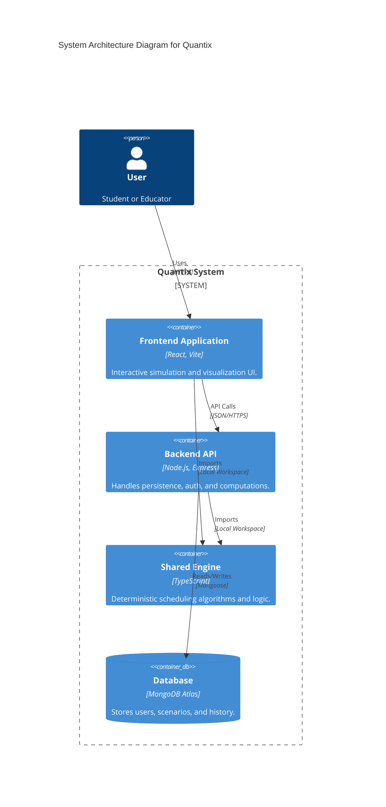
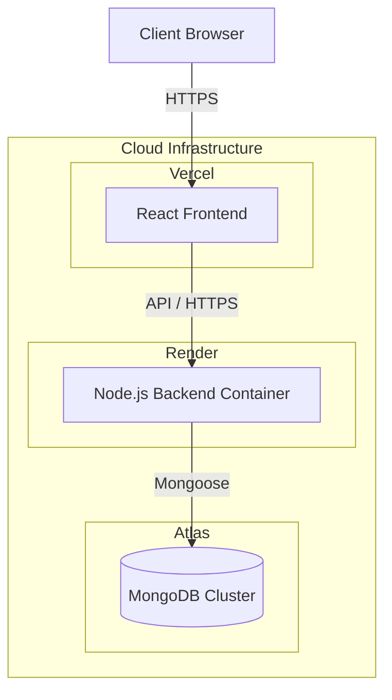
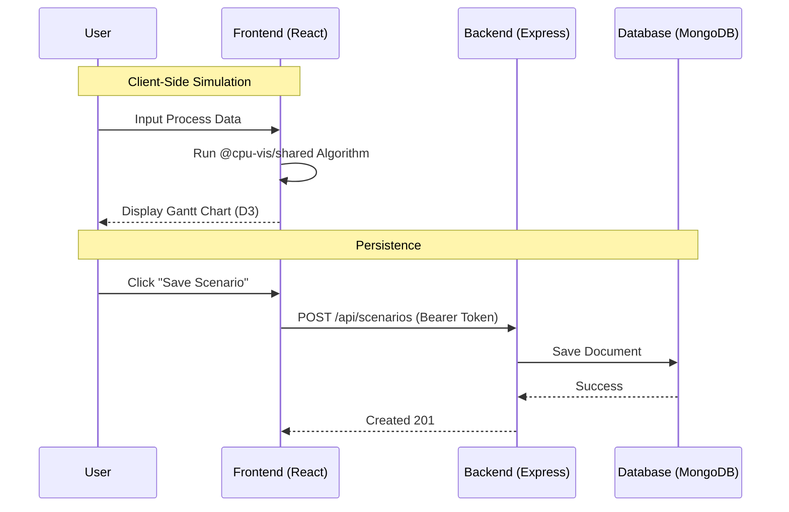

# System Architecture

## High-Level Overview (C4 Container)

## Overview

The Quantix is a full-stack monorepo designed for interactivity and performance.

- **Frontend**: React/Vite SPA (Vercel)
  - Interactive Gantt charts with D3.js (Keyboard & Screen Reader accessible)
  - State management for simulations
  - Offline-first PWA support
  - Internationalization (i18n) with 11 supported languages
  - Storybook for UI component documentation
- **Backend**: Express/Node.js API (Render)
  - Heavy simulation offloading
  - Batch processing
  - User authentication (JWT + OAuth Providers)
  - Persistence via MongoDB
- **Shared**: TypeScript core logic (`@cpu-vis/shared`)
  - Deterministic scheduling algorithms (15 total)
  - Extended process model (`priority`, `tickets`, `shareGroup`, `shareWeight`, `deadline`, `period`)
  - Multi-core scheduling support and context-switch modeling
  - Advanced statistical utilities (95th Percentile, Standard Deviation)
  - Energy consumption modeling
  - Property-based tests
  - Shared types and validation

## Deployment Architecture

## Data Flow

## Algorithms Supported

- **FCFS**: First-Come, First-Served
- **SJF**: Shortest Job First (Non-preemptive)
- **SRTF**: Shortest Remaining Time First (Preemptive)
- **RR**: Round Robin (Time Quantum)
- **PRIORITY**: Priority Scheduling (Preemptive/Non-preemptive)
- **MLFQ**: Multilevel Feedback Queue
- **MQ (MLQ)**: Multilevel Queue
- **LJF/LRTF**: Longest Job/Remaining Time First
- **HRRN**: Highest Response Ratio Next
- **FAIR_SHARE**: Group-weighted fair-share scheduling
- **LOTTERY**: Probabilistic ticket-based proportional sharing
- **EDF**: Earliest Deadline First
- **RMS**: Rate Monotonic Scheduling

## Security

- **Authentication**: JWT (JSON Web Tokens) with 7-day expiration.
- **Passwords**: Hashed with `bcryptjs`.
- **OAuth**: Google, GitHub, GitLab, Discord, LinkedIn.
- **CORS**: Configured for frontend domain.
